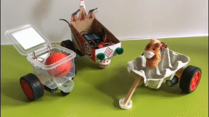
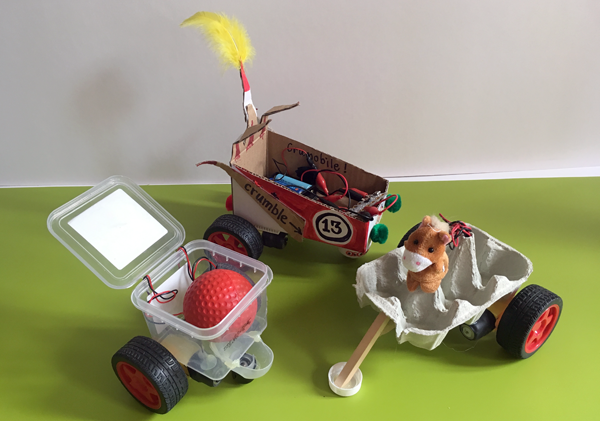

## Introduction

You will use your design, making and coding skills to build a robot buggy with DC gear motors controlled by a Crumble robotics board.

### What you will make

You will make a motor buggy to be controlled by your coding.

--- no-print ---

--- /no-print ---

--- print-only ---

--- /print-only ---

--- collapse ---
---
title: What you will need
---
### Hardware

+ A PC, Mac or Chromebook with Crumble software installed and a USB port

Note: All components except DC motors are included in the Crumble starter kit but can also be bought separately.

+ A Crumble controller
+ A 3xAA battery pack
+ Crocodile leads
+ 2 DC mini gear motors with wheels

+ Materials to make your buggy, e.g. a small box, food container, bottle or cardboard
+ Tools to make your buggy, e.g. glue or tape, and scissors

### Software

+ [Crumble software](https://redfernelectronics.co.uk/crumble-software/){:target="_blank"}

### Downloads

+ [rpf.io/build-crumble-motor-buggy-go](http://rpf.io/build-crumble-motor-buggy-go){:target="_blank"}

--- /collapse ---

--- collapse ---
---
title: What you will learn
---

+ How to connect DC motors to a Crumble controller board
+ How to coordinate two motors to control direction
+ How to code a pre-programmed buggy 'journey'

--- /collapse ---

--- collapse ---
---
title: Additional information for educators
---

If you need to print this project, please use the [printer-friendly version](https://projects.raspberrypi.org/en/projects/build-crumble-motor-buggy/print){:target="_blank"}.

[Here is a link to the code solutions for this project](http://rpf.io/p/build-crumble-motor-buggy-get).

--- /collapse ---
