## Challenge: create a maze

This is a fun challenge that you can make as quick or as complex as you like. You can design your maze for one player or for maze can be an individual one or a shared maze where you compete with friends to complete the maze first. You can work with friends to work out how to solve the tricky mathematical challenges that you will come across. 

How much longer does the buggy have to rotate to the right? What would happen if we changed the speed to 65%?

--- task ---

The first step is to make your maze. It can be as small or as large as you like and as space allows.

Here is an example:

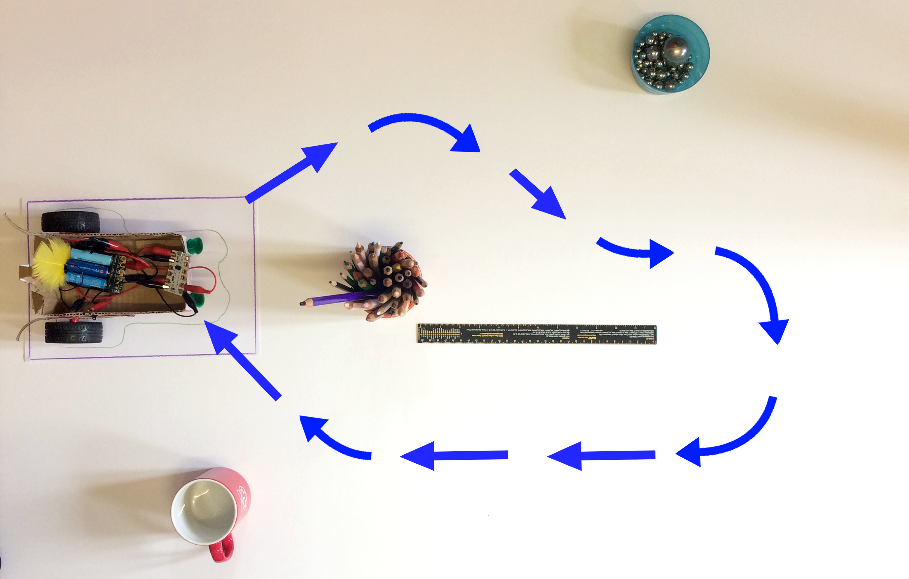

This example might seem quite easy, but getting your code right takes patience. This one has small passages and only needs right turns. Start with something simple then build on it!

--- /task ---

In this maze, the buggy has to start from the green shape and finish in the purple box.

--- task ---

When you have made your maze, start to make your program. Start with a `program start`{:class="crumblebasic"} block, then a `wait 1 second`{:class="crumblecontrol"} block to allow you time to turn the battery pack on and move your hand away.

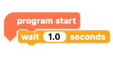

--- /task ---

--- task ---

From now on, you will need to write your program according to your maze.

Your buggy will need to go forward, turn left, or turn right.

Usually, to turn right, the motor on the left-hand side will go forward, while the motor on the right-hand side is stopped or, for a sharper turn, runs in reverse. To turn left, the motors will do the opposite.

In the example maze, the buggy will turn left first.

Add `motor 1`{:class="crumbleinputoutput"} (motor on the right-hand side) `FORWARD`{:class="crumbleinputoutput"} blocks to send the buggy to the left. There is no need to stop the motor on the left-hand side as it is not running yet.

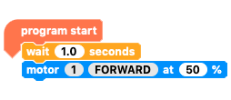

--- /task ---

--- task ---

Now, add a `wait`{:class="crumblecontrol"} block to decide how long the buggy will turn for. The longer the `wait`{:class="crumblecontrol"}, the further it will rotate.

**Note**: Increasing or decreasing the `motor speed %`{:class="crumbleinputoutput"} will also affect the amount of rotation.

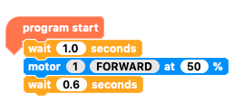

--- /task ---

Remember that your program must end by stopping the motors.

--- task ---

Only `motor 1`{:class="crumbleinputoutput"} is running but just to be sure, and for good practice, you will stop both motors.

Add two `motor`{:class="crumbleinputoutput"} blocks and toggle the boxes to `motor 1 STOP`{:class="crumbleinputoutput"} and `motor 2 STOP`{:class="crumbleinputoutput"}.

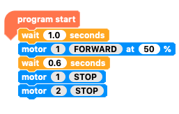

--- /task ---

The best way to code a maze run is one step at a time. So far, your program will make the buggy turn left then stop.

Write the program, then check it!

--- task ---

Run your program and check that you have the right `motor speed %`{:class="crumbleinputoutput"} and `wait`{:class="crumblecontrol"} time to get the right angle of rotation. If it is not right, adjust it and check again.

--- /task ---

You will always start from the beginning of the maze, so mark your starting point clearly so that you always start in exactly the same place and facing exactly the same way.

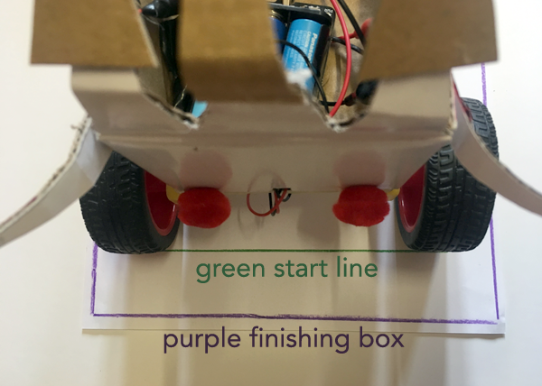

The next sequence of three blocks shows the pattern that you can follow to write the rest of your program:

+ Set motor 1
+ Set motor 2
+ Set the duration of the movement

--- task ---

To start, move the `STOP`{:class="crumbleinputoutput"} blocks away from the program.

Since you are about to go forwards, set `motor 1`{:class="crumbleinputoutput"} and `motor 2`{:class="crumbleinputoutput"} to go `FORWARD`{:class="crumbleinputoutput"}. You could set them at `50%`{:class="crumbleinputoutput"} for now.

The third block in the pattern should be a `wait`{:class="crumblecontrol"} block, so that you can set the duration of the movement.

Enter a `wait`{:class="crumblecontrol"} time.

Make sure that you put the `STOP`{:class="crumbleinputoutput"} blocks back before you run the program.

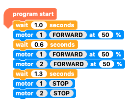

--- /task ---

Next, your buggy will turn to the right. Follow the same pattern:

+ Set motor 1
+ Set motor 2
+ Set the duration of the movement

--- task ---

Remove the `STOP`{:class="crumbleinputoutput"} blocks.

To turn right, set `motor 1`{:class="crumbleinputoutput"} to `STOP`{:class="crumbleinputoutput"} and `motor 2`{:class="crumbleinputoutput"} to go `FORWARD`{:class="crumbleinputoutput"}.

Then, add a `wait`{:class="crumblecontrol"} block to set the duration of the turn.

Put the `STOP`{:class="crumbleinputoutput"} blocks back.

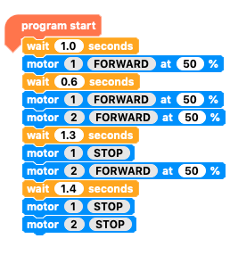

--- /task ---

Continue your program in this order, adding a 'forwards' sequence followed by a 'turn' sequence and so on.

### Mistakes will happen

In the example, one of the buggy's movements is wrong:

--- no-print ---

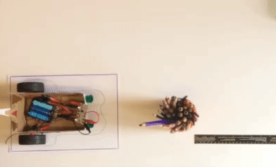

--- /no-print ---

--- print-only ---

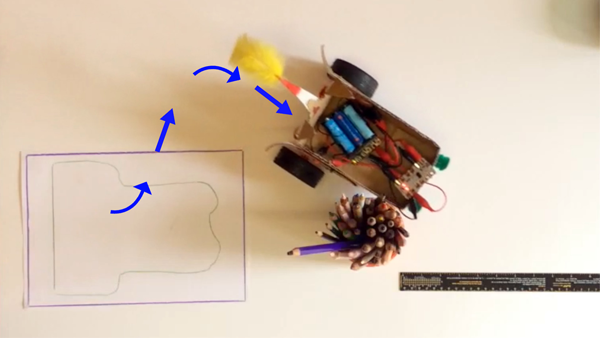

--- /print-only ---

When something doesn't go as planned, look carefully at where it went wrong. This is a good opportunity to see if you understand your code.

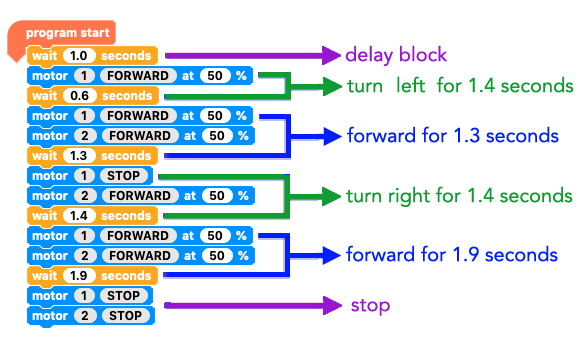

In the example, the turn before the movement forwards was wrong, not the movement forwards itself:
+ Because the last thing that was added was the movement forwards, it is easy to think that this must be the problem
+ However, before the buggy moved forwards, the buggy turned too far, so it was pointing too close to the mug
+ The movement forwards was fine, but the turn time needed to be lower!

Make sure that you have got your code right before you go on to the next move. This makes it much easier to find what you need to change.

### Long lines of code

The program for this example maze got so long that it went right off the bottom of the screen!

Click on and drag the white background to move around the workspace. As you do this, the normal arrow cursor turns into a four-pointed arrow cursor.

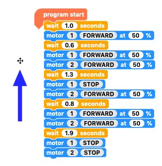

--- task ---

Follow the three-block sequence to add more movements until you have completed your maze:

+ Set motor 1
+ Set motor 2
+ Set the duration of the movement

--- /task ---

### The completed maze

Here is what the code looked like for the example buggy when it completed the example maze.

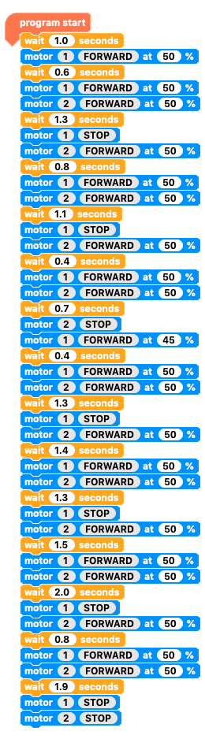

--- no-print ---

And here is the buggy in action!

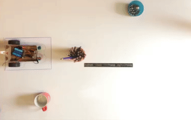

--- /no-print ---
