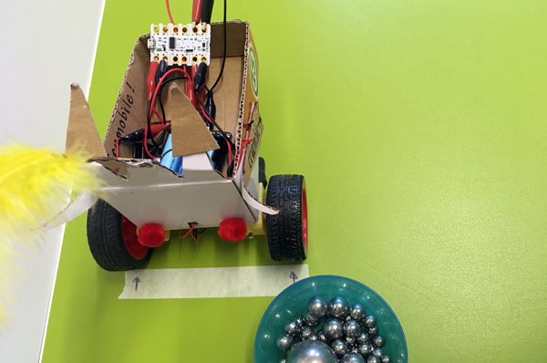

## Code challenge 1 - Crumball

Crumball is like football, but played with Crumbles instead of feet.

Its basic coding is much like the maze challenge but with shorter code and added pressure!

This is coding against the clock, or rather, coding against your opponent. The game is designed for two Crumble motor buggies but you could try it with more and you can always practice on your own too.

### The game

As with football, you need a pitch with a goal at each end.

The ball starts in the middle and the object of the game is to knock the ball into the opposite goal.

Players always start off in a set position just to side of their goal facing directly forward. The coders must write code to score a goal as quickly as they can to beat their opponent. 

As soon as your code is done and loaded,  you can unplug your Crumble, put your buggy in its set position facing forward and off it goes.

Once a Crumble is set in motion:

+ it must complete its code without being stopped, interrupted or picked up
+ as soon as the Crumble has completed running its code it must be removed from the pitch so that it does not block the other player
+ once removed it is time to start coding again straight away for your next shot

If you are too slow with your coding, the other player might have moved the ball with their Crumble and your code will need changing.

Note: every shot starts from the same set position and always facing directly forwards!

--- task ---

Make a Crumball pitch.

A large sheet of paper would be fine but often it's easiest to mark a pitch out on the floor with masking tape or similar.

Use anything handy for goal posts and any small ball will do for the Crumball itself.

Mark the set positions for each player's buggy. In the example there are little arrows on masking tape to show the position each wheel starts in.

--- /task ---