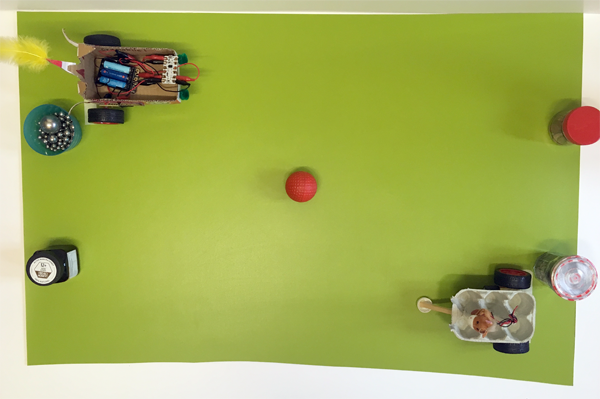
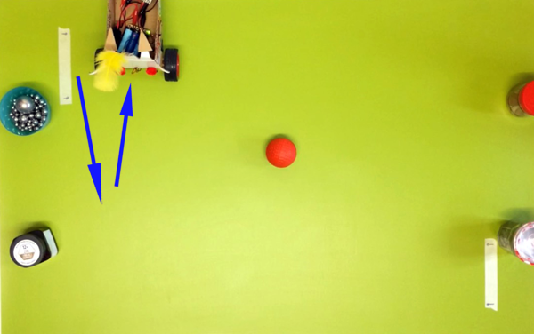

## Challenge: play 'Crumball'

'Crumball' is like football, but you use Crumbles instead of your feet.

The program is like the program in the maze challenge, but it is shorter and has added pressure!

You will code against the clock, or rather, against your opponent. The game is designed for two Crumble motor buggies, but you could try it with more, or you could practise on your own.

### The game

As with football, you need a pitch with a goal at each end. The ball starts in the middle and the aim of the game is to knock the ball into the opposite team's goal.

Players always start off in a set position: to the side of their goal, facing forwards. The players must write code to score a goal as quickly as they can to beat their opponent. 

As soon as your code is written and loaded onto your Crumble, you can unplug your Crumble, put your buggy in its set position facing forward, then it will set off.

Once a Crumble is set in motion:

+ Its program must run without being stopped, interrupted, or picked up
+ As soon as the program has finished running, the Crumble must be removed from the pitch so that it does not block the other player
+ Once the Crumble has been removed, start coding your next shot

If your coding is too slow, the other player might have moved the ball with their Crumble, so you will need to change your code.

**Note**: every shot starts from the same set position and always facing forwards!

--- task ---

Make a Crumball pitch.

You could use a large sheet of paper or plan a pitch on the floor. Make sure that you include goalposts!

You can use any small ball for the Crumball itself.

Mark the set positions for each player's buggy. In the example, there are arrows on masking tape to show the position for each wheel to start in.

--- /task ---

### Start coding!

Your code will depend on the shot you want to make and where the ball is, but in general, there is a simple code structure that you can write and then adapt for any shot.

+ Rotate to the space in front of the ball
+ Move towards that space
+ Rotate to the angle you want the move the ball in
+ Move forward towards the goal
+ Stop motors

**Note:** remember to stop the motors!

--- task ---

Take the usual start blocks: a `program start`{:class="crumblebasic"} and a `wait 1 second`{:class="crumblecontrol"} block.

--- /task ---

Now, write the code for the rotation to the space in front of the ball.

--- task ---

Add two `motor`{:class="crumbleinputoutput"} blocks and a `wait`{:class="crumblecontrol"} block.

One motor will be going `FORWARD`{:class="crumbleinputoutput"} and the other in `REVERSE`{:class="crumbleinputoutput"}, depending on the way you want to turn. 

Set the `wait`{:class="crumblecontrol"} block to however long you think it will take to get to the right angle.

--- /task ---

Next, write the code to move to where the ball is.

--- task ---

Again, add two `motor`{:class="crumbleinputoutput"} blocks and a `wait`{:class="crumblecontrol"} block.

Both motors will be going `FORWARD`{:class="crumbleinputoutput"}.

Set the `wait`{:class="crumblecontrol"} block to however long you think it will take to get just in front of the ball.

--- /task ---

Then, write the code to rotate to the direction you want to knock the ball in.

--- task ---

As with every move in this game, add two `motor`{:class="crumbleinputoutput"} blocks and a `wait`{:class="crumblecontrol"} block.

Set the motors to `FORWARD`{:class="crumbleinputoutput"} or `REVERSE`{:class="crumbleinputoutput"} to turn in the right direction.

Set the `wait`{:class="crumblecontrol"} time.

--- /task ---

Now, write the code to push the ball forwards towards the goal.

--- task ---

Set both motors to go `FORWARD`{:class="crumbleinputoutput"} for however many `seconds`{:class="crumblecontrol"} you think it will take to score a goal.

Remember that you cannot get your buggy back until it stops moving, so don't drive too far!

--- /task ---

Don't forget to stop!

--- task ---

Set both motors to `STOP`{:class="crumbleinputoutput"}.

--- /task ---

The program that you have just written should form the basic structure of every shot you take. You don't need to write it again for each shot, just adjust the speed or duration of your last shot.

### Kick-off!

--- task ---

As soon as you have written your program, unplug your Crumble and take your shot. Try to score a goal before your opponent is ready!

Good luck!

--- no-print ---

--- /no-print ---

--- print-only ---

--- /print-only ---

--- /task ---

My first shot went very wrong, but it is unlikely to go right first time. 

My initial turn time was much too long, so I adjusted my code and tried again. The speed was often set to 100%, which also makes it hard to control. Find a balance between speed to beat your opponent and getting things right.

By working out what you need to change to get a better aim, you will soon make some great shots. You don't have to win the match in one shot!

--- no-print ---

--- /no-print ---

