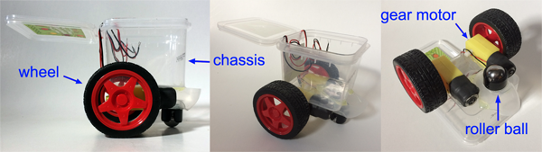
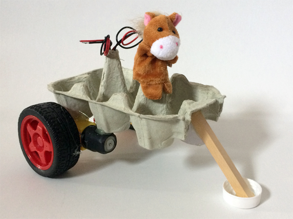

## Design your motor buggy

In this step, you will design your motor buggy. You can decide what it looks like and what it is made of. 

There are a few things that you need to include:
+ The main body (chassis) of the buggy, with space for the Crumble and battery box
+ Two DC gear motors that can be fixed to the chassis
+ Wheels to fit on gear motors
+ One front roller ball wheel (or something smooth that will slide, e.g. a bottle lid, marble, or ping-pong ball)

The rest is up to you!

This is what a very basic (and very small) motor buggy could look like:

To create your design, think about the resources available to you, the task, and timing, and use your imagination! It may be a design-heavy build, or you may want something simple and functional.

