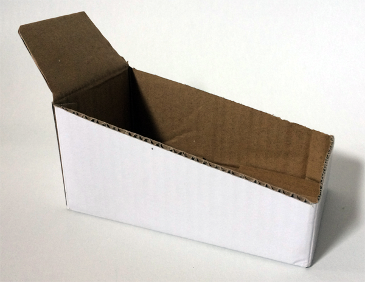
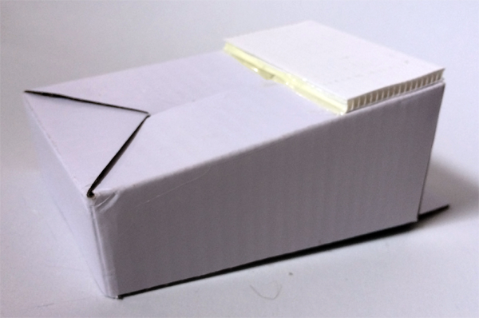
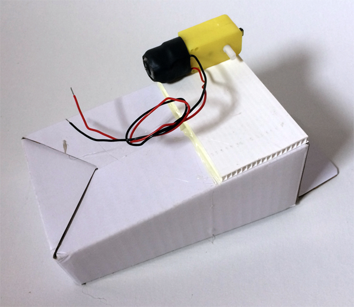
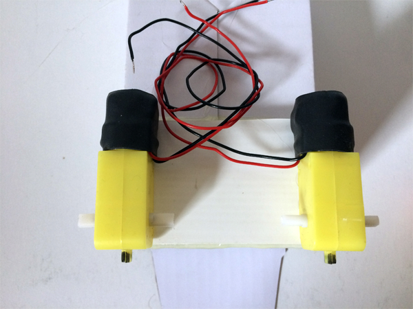
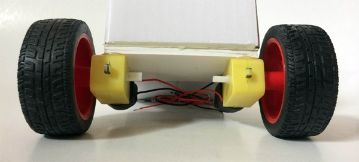
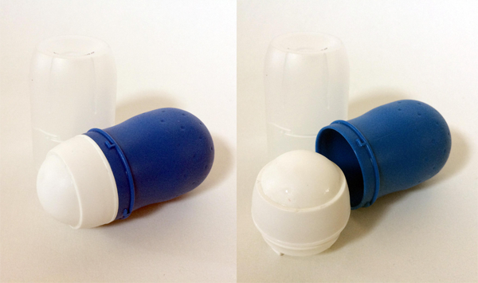
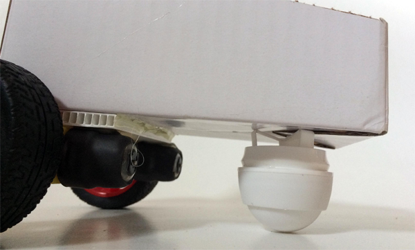
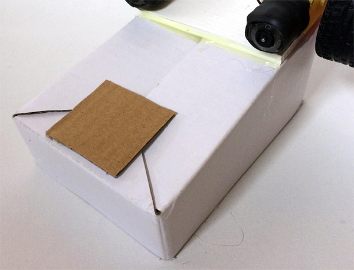
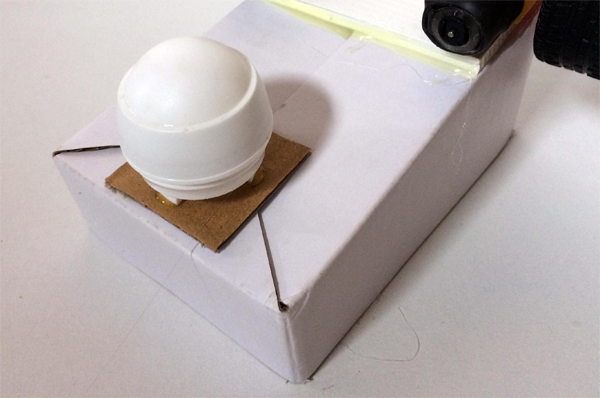
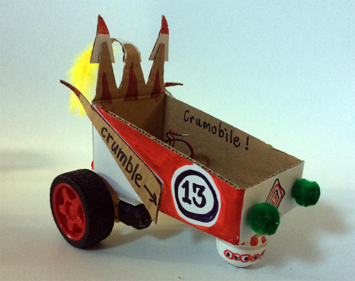

## Making your buggy

--- task ---

The first step is to find, or make, your chassis that will be the base for your gear motors and hold the electronics.

--- /task ---

--- task ---

If your chassis is not very strong or is too flexible then it is worth sticking a bit of stronger board where the motors are going to be attached to keep everything steady. 

--- /task ---

--- task ---

A glue gun is ideal for fixing the motors in place but double sided tape also works fine.

Make sure that the motor sticks out enough to put the wheels on without them rubbing, particularly if using a chassis with angled sides such as margarine tub or old takeaway container.

The wires, or terminals, of the motors need to be facing inwards. If they face outwards they will get tangled with the wheels.

--- /task ---

--- task ---

Try and get the two motors lined up together so that they are the same distance from the back, or front, and parallel.

--- /task ---

--- task ---

You will need to have the motors overhanging a little bit so that the wheels sit away from the chassis and can turn without rubbing.

If you are not sure how far they need to stick out, you could always fix them in place with the wheels already attached to the gear motors. The motors are usually quite a tight fit but should just push onto the plastic spigot coming out of the side of the gear motor.

--- /task ---

--- task ---

Old roll-on deodorants make pretty good roller ball castors. Just pull the top off the deodorant and give it a quick wash.

--- /task ---

Whatever you are using for your rollerball, check how level the buggy is going to be when you attach it to the chassis. Roller balls work best when they are roughly level so you might want to put in some cardboard spacers to raise it if your roller ball is much smaller than your wheels.

The deodorant roller ball in this example buggy is quite level but since the box is quite flimsy it is a good idea to put a little cardboard base down first.

--- task ---

Fix your roller ball onto the supporting base or directly to the chassis.

--- /task ---

--- task ---

Now that the functional build is done, it is time to get fancy with your motor buggy and turn it into something wonderful... if you want to, of course!

--- /task ---