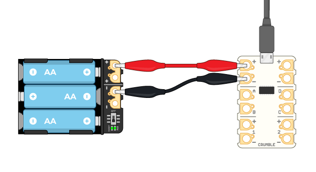
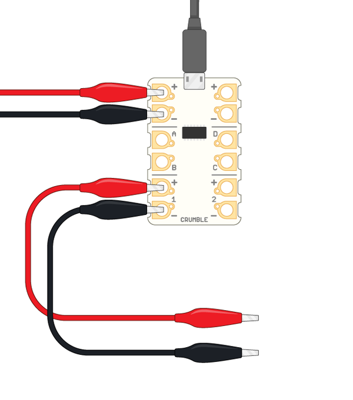
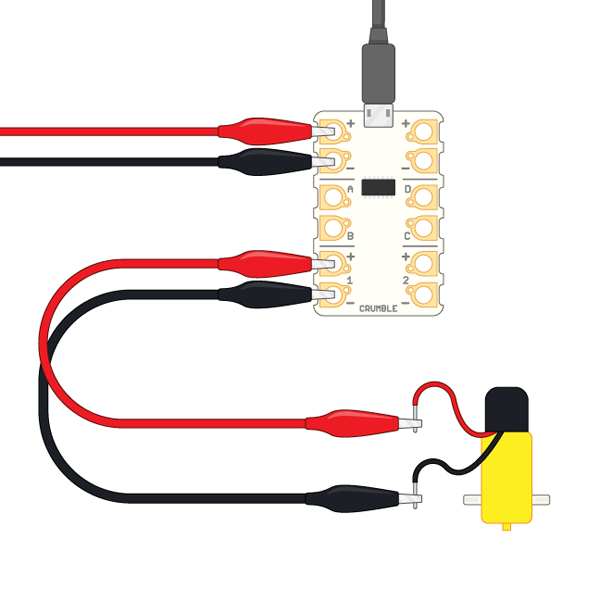
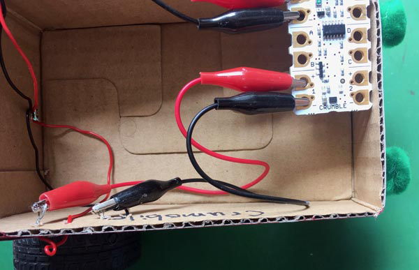
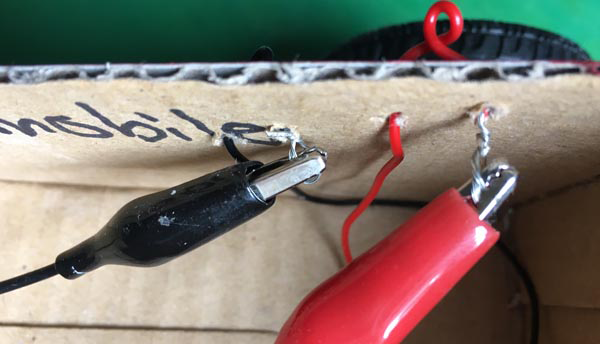
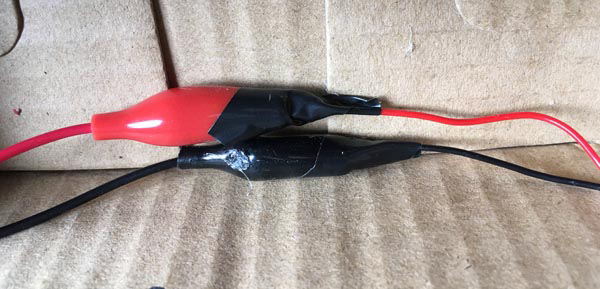
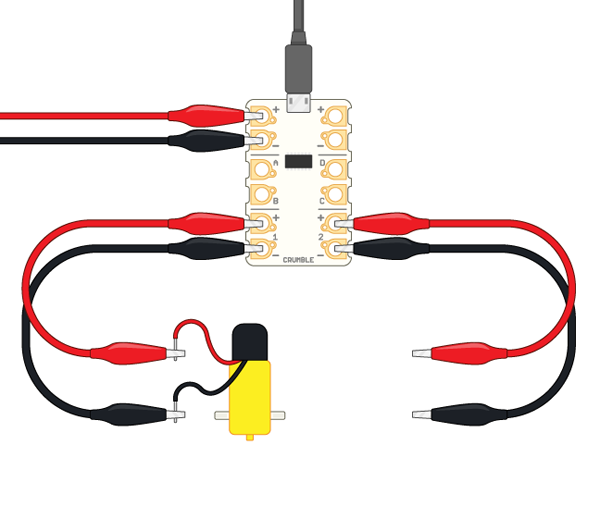
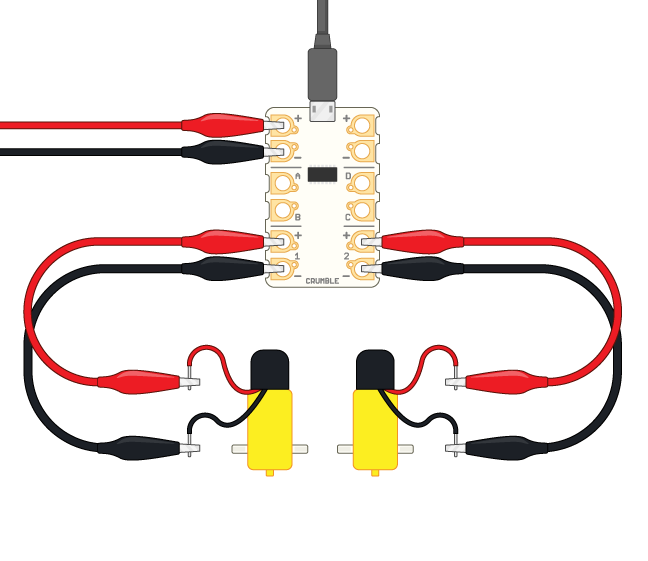
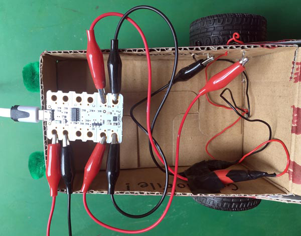
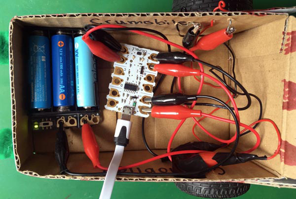

## Wire up your buggy

First of all, think about some different motors and connectors.

In the Getting started with Crumble project, you learned about connecting DC motors, but the example used an ordinary DC mini motor like the ones that are found in many schools. These generally have very high speeds but low torque, which means that a buggy might run very fast, but the motors would find it really hard to get moving from a stopped position. This is not much use for this project.

Gear motors come in many shapes and sizes. Often, you'll find very affordable yellow plastic ones, which are simply standard DC mini motors combined with plastic gears.

Many of these inexpensive gear motors come with bare positive and negative terminals like the ones in the image below. It can be tricky to keep crocodile clips on these when the buggy moves and they often break off, so it may be best to avoid these. 

Some gear motors, such as those found in the CamJam EduKit 3 Robotics Kit, have wires already soldered on and shrink-tubed in place. These are much easier to connect and much more robust. These are the motors that you will see in this example build.

The best version of all for the Crumble board are the gear motors sold by the makers of Crumble, [Redfern Electronics](https://redfernelectronics.co.uk/product/pair-of-geared-motors/){:target="_blank"}, who make gear motors with crocodile leads already attached. This makes the motors easy to connect, and also makes the wiring easier to understand.

### Connect to the Crumble

As in other projects, you will connect the Crumble board to your computer with a micro USB cable, and to a battery pack, or similar power supply, with crocodile clips.

--- task ---

Connect a crocodile clip to each of the positive and negative terminals of the motor 1 output in the bttom left-hand corner of the Crumble board.

--- /task ---

--- task ---

Connect the other end of these crocodile clips to the positive and negative wires (or terminals) of one of the gear motors. At this stage, it  doesn't matter which gear motor you connect it to, just make sure that the positive and negative wires are both coming from the same motor.

In this example, the Crumble motor 1 connectors are connected to the right-hand gear motor.

Here's how that might look in the real world:

--- /task ---

**Note**: As in the example, you could attach the right-hand gear motor wires to the right-hand side of the chassis by threading the wire through the side wall and back in. 

This has a few benefits:

+ It makes it clear which wires are for which motor
+ It keeps the wires and crocodile clips attached in position and out of the way
+ It helps to keep the exposed metal parts of wires and crocodile clips away from each other so that they don't touch!

On the left-hand side, I have taped the connections with electrical tape to show an alternative way to stop the exposed metal parts of the wires and crocodile clips touching.

Choose either of these methods, or any other method that works for you and the materials you have.

Now, do the same for the second motor.

--- task ---

Connect a crocodile clip to each of the positive and negative terminals of the motor 2 output in the bottom right-hand corner of the Crumble board.

--- /task ---

--- task ---

Connect the other end of this second set of crocodile clips to the positive and negative wires (or terminals) of the second gear motor. 

Here's how it might look in your motor buggy.

--- /task ---

--- task ---

Now, arrange all of the components inside or around your motor buggy so that it can move around. You need to find a space for the Crumble controller board, the battery pack, and all of the wires.

Later, when your buggy is fully coded, you will disconnect the USB cable so that your robot motor buggy can roam freely. Make sure that you can easily get to the USB port so that you can change the code whenever you want to.

--- /task ---

That's all! Your buggy is now ready for coding.
