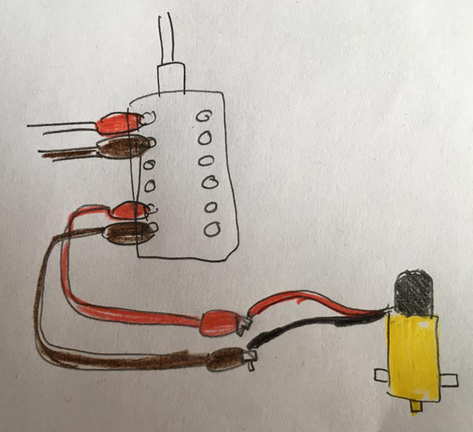

## Wiring up your Crumble buggy

First of all, let's just have a look at some different motors and connectors.

In the Getting started with Crumble project we looked at connecting DC motors but the example used an ordinary DC mini motor of the kind that are found in many schools. These generally have very high speeds but low torque which means a buggy might run very fast but the motors would find it really hard to get moving at all from a stopped position. This is not much use for this project.

Gear motors come in many shapes and sizes but commonly you'll find very affordable (cheap as chips) yellow plastic ones that simply a standard DC mini motor combined with plastic gears.

Many of these inexpensive gear motors come with bare positive and negative terminals like the ones in the image below. It can be tricky to keep crocodile clips on these as the buggy moves and they often break off making the motor quite useless. 

Some gear motors, such as those found in the CamJam EduKit 3 Robotics Kit, have wires already soldered on and shrink-tubed in place. These are much easier to connect and much more robust. These are the motors that you will see in this example build.

The best version of all for the Crumble are the gear motors sold by the makers of Crumble, [Redfern Electronics](https://redfernelectronics.co.uk/product/pair-of-geared-motors/){:target="_blank"}, who make gear motors will crocodile leads already attached. This makes the motors not only easy to connect but also make the wiring easier to understand.

### Connecting to the Crumble

As with all our projects, the Crumble board will be connected to your computer with a micro USB cable and to a battery pack, or similar power supply using crocodile clips.

--- task ---

Connect a crocodile clip to each of the positive and negative terminals of the motor 1 output on the bottom left of the Crumble board

--- /task ---

--- task ---

Connect the other end of these crocodile clips to the positive and negative wires (or terminals) of one of the gear motor. At this stage it really doesn't matter which gear motor you connect it to, just make sure that you have the positve and negative wires both coming from the same motor.

In this example, the Crumble motor 1 connectors are connected to the right-hand gear motor.

--- /task ---

Note: I have attached the right-hand gear motor wires to the right-side of the chassis. In this case by threading the wire through the side wall and back in. 

This has a few benefits:

+ It makes it clear which wires are for which motor
+ It keeps the wires, and croc clips attached in position and out of the way
+ It helps to keep the exposed metal parts of wires and croc clips away from each other so they don't touch!

On the left-hand side I have taped the connections with electrical tape to show an alternative way to stop the exposed metal parts of the wires and croc clips touching.

Choose either of these or any other method that works for you and the materials you have.

Now we do the same for the second motor.

--- task ---

Connect a crocodile clip to each of the positive and negative terminals of the motor 2 output on the bottom right of the Crumble board.

--- /task ---

--- task ---

Connect the other end of this second set of crocodile clips to the positive and negative wires (or terminals) of one of the second gear motor. 

--- /task ---

That's all, your buggy is now ready for coding!
