## Test code for motors

Before we can start properly coding your motor buggy, you need to gather some information. Some of this we can find out just by looking at the buggy, but some we will have to right some test code to be sure.

+ Which motor output controls which gear motor
+ When the right gear motor is programmed to go forward, does the right side of the buggy go forwards or backwards
+ When the left gear motor is programmed to go forward, does the left side of the buggy go forwards or backwards

Just because the we use the code block that says forwards, it does not mean that the buggy moves forwards.

The gear motors are nor aligned in the same way. The left motor is a mirror image of the right motor which means that (if it has been wired up the same, i.e. positive to positive and negative to negative) it will make the attached wheel turn in the opposite direction!

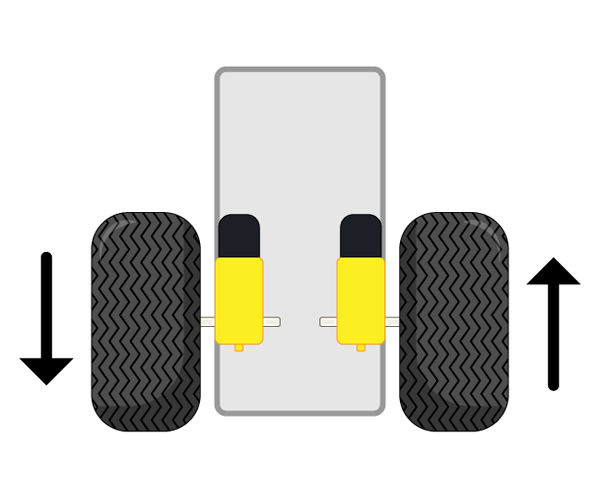

--- task ---

The first thing to do is check which Crumble motor output is connected to which gear motor. This can be done using code but it is easy just to follow the wires from the gear motors and see where they lead.

In this example project:
+ Crumble motor 1 output controls the right-hand gear motor
+ Crumble motor 2 output controls the left-hand gear motor

--- /task ---

Next, we need to use code to test programming a motor to go forward will do.

--- task ---

As usual, your code will start with a `program start`{:class="crumblebasic"} block.

From `Input/Output`{:class="crumbleinputoutput"} palette, grab a `motor 1 FORWARD at 75%`{:class="crumbleinputoutput"} block and place it under your `program start`{:class="crumblebasic"} block.

Duplicate the `motor 1 FORWARD at 75%`{:class="crumbleinputoutput"} block, and toggle the `FORWARD`{:class="crumbleinputoutput"} until the block reads, `motor 1 STOP`{:class="crumbleinputoutput"}.

Finally, from the `Control`{:class="crumblecontrol"} blocks menu, pick a `wait 100 milliseconds`{:class="crumblecontrol"} block and adjust the time to `wait 300 milliseconds`{:class="crumblecontrol"}.

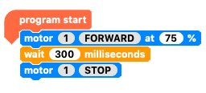

When you run the code, the right-hand motor (in this example) should either move forwards or backwards.

--- no-print ---

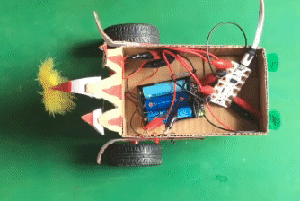

--- /no-print ---

--- print-only ---

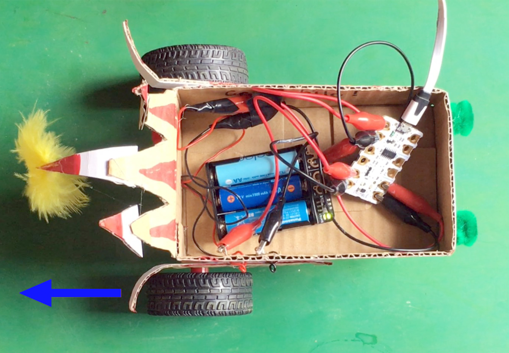

--- /print-only ---

--- /task ---

Since motor 1 output forward makes the right motor go backwards, programming the motor 1 output to go backwards must make the right motor go forwards. Let check that to make sure.

--- task ---

Toggle the `FORWARD`{:class="crumbleinputoutput"} in the first `motor`{:class="crumbleinputoutput"} block until the block reads, `motor 1 REVERSE at 75%`{:class="crumbleinputoutput"}.

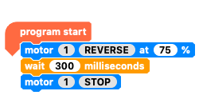

Now run the code to check the motor runs in the oppositie direction, i.e. forwards.

--- no-print ---

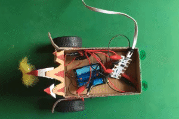

--- /no-print ---

--- print-only ---

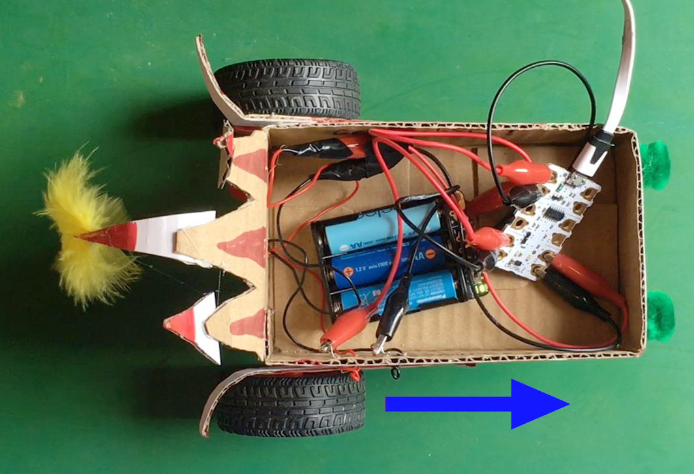

--- /print-only ---

--- /task ---

As long as I remember that `FORWARD`{:class="crumbleinputoutput"} means backwards for the right-hand motor, my code should work out fine but it would be much easier for me if `FORWARD`{:class="crumbleinputoutput"} really did mean forwards.

Whether the motors goes one way or another is simply a matter of polarity. In other words, it is a matter of which way round the positive and negative wires are connected. in the case of the motors this is not important, so in this example I am going to switch the positive and negative wires around. I could do this anywhere in the circuit but I'll do where the croc clips meet the gear motor wires.

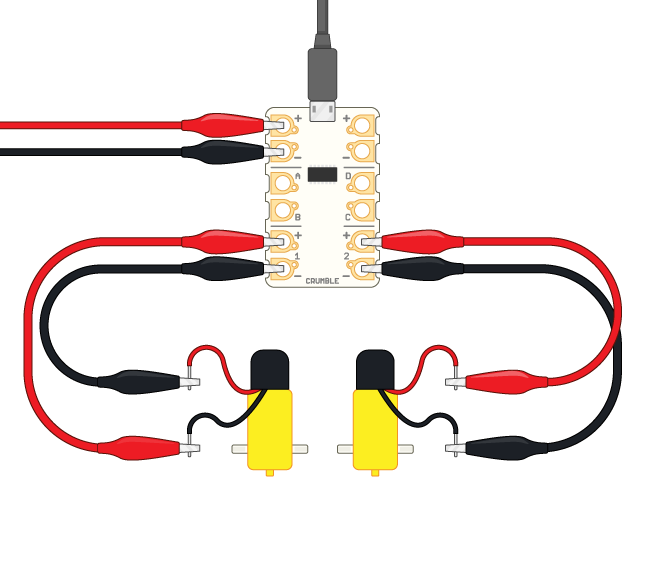

WARNING: It is safe to reverse the polarity on these gear motors but in other situations reversing the positive and negative polarity can damage components.

--- task ---

Run your last code, `motor 1 REVERSE`{:class="crumbleinputoutput"}, again to see if everything works to plan and the motor now runs in reverse when programmed to do so.

--- no-print ---

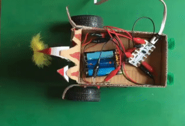

--- /no-print ---

--- print-only ---

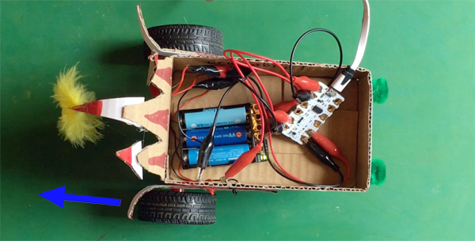

--- /print-only ---

--- /task ---

Great. Now that the right motor does exactly as it is told to do, it is time to do the same for the left-hand gear motor.

--- task ---

Toggle the `1`{:class="crumbleinputoutput"} in the both `motor`{:class="crumbleinputoutput"} blocks so that they read, `motor 2`{:class="crumbleinputoutput"} so that we can test the left gear motor.

Then toggle the `REVERSE`{:class="crumbleinputoutput"} in the first `motor`{:class="crumbleinputoutput"} block until the block reads, `motor 2 FORWARD at 75%`{:class="crumbleinputoutput"}.

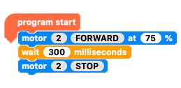

Run the code.

--- no-print ---

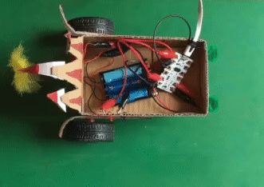

--- /no-print ---

--- print-only ---

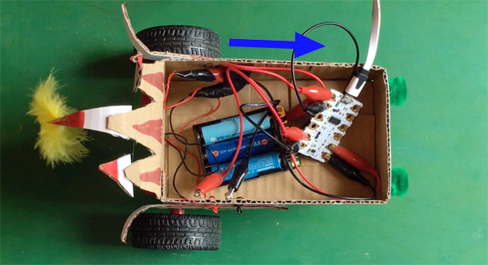

--- /print-only ---

--- /task ---

Since the left-hand gear motor goes forward when programmed to go `FORWARD`{:class="crumbleinputoutput"}, there is no need to reverse the posrity.

We now know that in this example project:

+ Motor 1 output forward makes the right-hand wheel go forwards.
+ Motor 1 output reverse makes the right-hand wheel go backwards.
+ Motor 2 output forward makes the left-hand wheel go forwards.
+ Motor 2 output reverse makes the left-hand wheel go backwards.

Let's write a little code to check this all together.

--- task ---

Duplicate `motor`{:class="crumbleinputoutput"} and `wait`{:class="crumblecontrol"} blocks as needed to write code telling `motors 1 and 2`{:class="crumbleinputoutput"} to go `forward`{:class="crumbleinputoutput"} `wait for 0.3 seconds`{:class="crumblecontrol"}, then `both motors`{:class="crumbleinputoutput"} go `backwards`{:class="crumbleinputoutput"}, `wait`{:class="crumblecontrol"} again before `both motors stop`{:class="crumbleinputoutput"}.

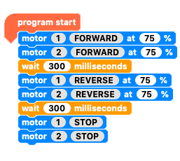

Run the code.

--- no-print ---

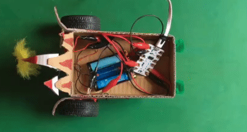

--- /no-print ---

--- print-only ---

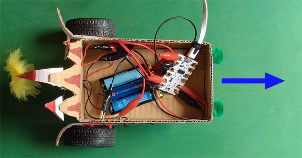

--- /print-only ---

--- /task ---

You now have all the information you need to write code and control what your motor buggy does!