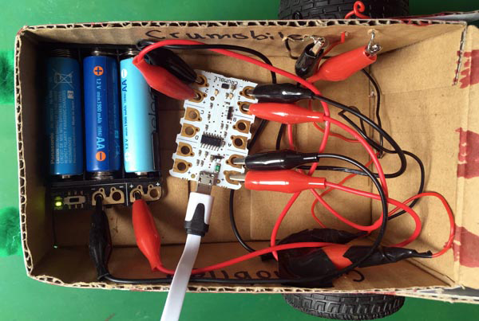

## Test code for motors

Before we can start properly coding your motor buggy, you need to gather some information. Some of this we can find out just by looking at the buggy, but some we will have to right some test code to be sure.

+ Which motor output controls which gear motor
+ When the right gear motor is programmed to go forward, does the right side of the buggy go forwards or backwards
+ When the left gear motor is programmed to go forward, does the left side of the buggy go forwards or backwards

Just because the we use the code block that says forwards, it does not mean that the buggy moves forwards.

The gear motors are nor aligned in the same way. The left motor is a mirror image of the right motor which means that (if it has been wired up the same, i.e. positive to positive and negative to negative) it will make the attached wheel turn in the opposite direction!

--- task ---

The first thing to do is check which Crumble motor output is connected to which gear motor. This can be done using code but it is easy just to follow the wires from the gear motors and see where they lead.

In this example project:
+ Crumble motor 1 output controls the right-hand gear motor
+ Crumble motor 2 output controls the left-hand gear motor

--- /task ---

--- task ---

The first thing to do is check which Crumble motor output is connected to which gear motor. This can be done using code but it is easy just to follow the wires from the gear motors and see where they lead.

In this example project:
+ Crumble motor 1 output controls the right-hand gear motor
+ Crumble motor 2 output controls the left-hand gear motor

--- /task ---