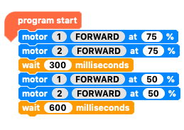
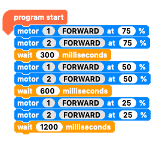
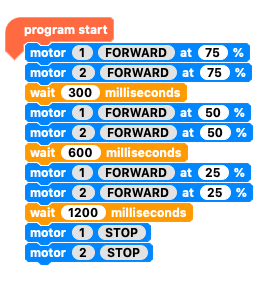
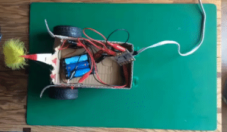
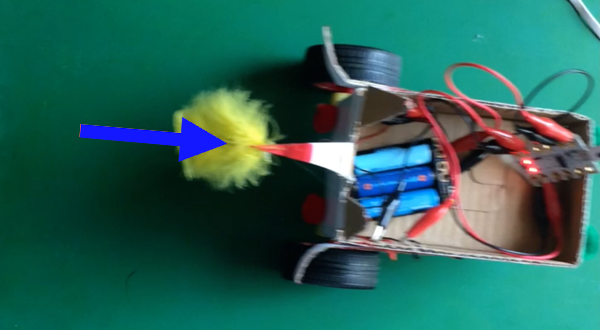

## Forwards, backwards, right and left

We have already looked at how to make your motor buggy go forwards and backwards. Now we are going to look at controlling the speed as well as turning left and right.

### Controlling the speed

--- task ---

Starting, of course, with a `program start`{:class="crumblebasic"} block, add two `motor`{:class="crumbleinputoutput"} blocks, one for `motor 1`{:class="crumbleinputoutput"} and the other for `motor 2`{:class="crumbleinputoutput"}.

Add a `wait`{:class="crumblecontrol"} block and change it to `wait 300 milliseconds`{:class="crumblecontrol"}.

--- /task ---

--- task ---

Duplicate these three blocks and place them beneath the existing ones. 

Change the `motor`{:class="crumbleinputoutput"} speed to `50%`{:class="crumbleinputoutput"} and the `wait`{:class="crumblecontrol"} time to `600 milliseconds`{:class="crumblecontrol"}.

--- /task ---

--- task ---

Now duplicate the last three blocks and place them at the bopttom of your code. 

Change the `motor`{:class="crumbleinputoutput"} speed to `25%`{:class="crumbleinputoutput"} and the `wait`{:class="crumblecontrol"} time to `1200 milliseconds`{:class="crumblecontrol"}.

--- /task ---

--- task ---

Lastly, add two `motor`{:class="crumbleinputoutput"} blocks telling the motors to `STOP`{:class="crumbleinputoutput"}.

Run your code and see the buggy run at three different speeds.

If the change is too quick, make longer waiting times and run it again.

--- /task ---

--- no-print ---

--- /no-print ---

--- print-only ---

--- /print-only ---

### Right and left

