## Control the speed and turns

You have already learned how to make your motor buggy go forwards and backwards. Now, you will learn about controlling the speed and turning left and right.

### Controlling the speed

--- task ---

Start with a `program start`{:class="crumblebasic"} block, then add two `motor`{:class="crumbleinputoutput"} blocks, one for `motor 1`{:class="crumbleinputoutput"} and the other for `motor 2`{:class="crumbleinputoutput"}.

Add a `wait`{:class="crumblecontrol"} block and change it to `wait 300 milliseconds`{:class="crumblecontrol"}.

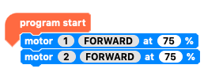

--- /task ---

--- task ---

Duplicate these three blocks and place them beneath the existing ones. 

Change the `motor`{:class="crumbleinputoutput"} speed to `50%`{:class="crumbleinputoutput"} and the `wait`{:class="crumblecontrol"} time to `600 milliseconds`{:class="crumblecontrol"}.

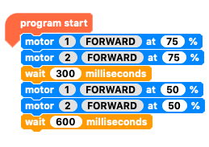

--- /task ---

--- task ---

Now duplicate the last three blocks and place them at the bopttom of your code. 

Change the `motor`{:class="crumbleinputoutput"} speed to `25%`{:class="crumbleinputoutput"} and the `wait`{:class="crumblecontrol"} time to `1200 milliseconds`{:class="crumblecontrol"}.

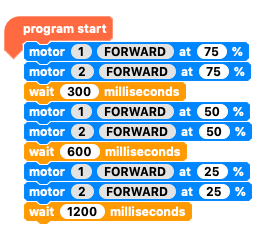

--- /task ---

--- task ---

Finally, add two `motor`{:class="crumbleinputoutput"} blocks that tell the motors to `STOP`{:class="crumbleinputoutput"}.

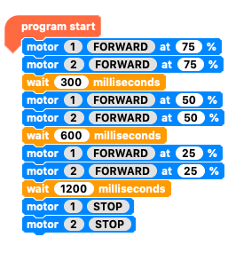

Run your program. The buggy should run at three different speeds.

If the change is too quick, make the waiting times longer, then run the program again.

--- no-print ---

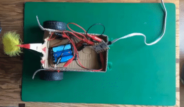

--- /no-print ---

--- print-only ---

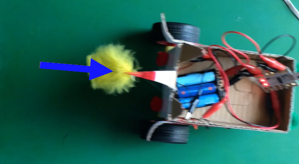

--- /print-only ---

--- /task ---

### Set your Crumble free!

While the Crumble is connected to your computer, it is getting continuous power through the USB cable. Turning your battery pack on or off does not turn the Crumble on and off, but when you unplug the USB cable, the code that was last run on your Crumble will run as soon as the battery pack is turned on.

In this case, the Crumble buggy will start moving forward at slower and slower speeds until, after 2.1 seconds, it stops.

At the moment, there is a problem with the code: the motors will start as soon as you turn the power on, and you won't have time to move your hands out of the way!

--- task ---

Add a short `delay`{:class="crumblecontrol"} block to the beginning of your code to give you time to move out of the way when you turn your battery pack on.

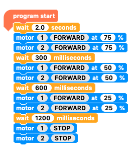

Run your program to transfer the changes to the Crumble controller, then turn the battery pack off and unplug the USB cable.

Find some space and turn the battery pack on to set your buggy in motion.

--- no-print ---

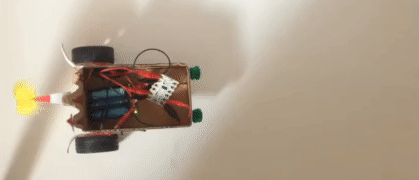

--- /no-print ---

--- print-only ---

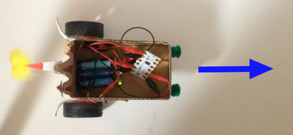

--- /print-only ---

--- /task ---

### Turning right and turning left

You know how to make your buggy go forwards and backwards, but how can you make it turn right or left?

If only the motor on the left-hand side was turned on and it went forwards, what would your buggy do?

--- task ---

Put your buggy on a sheet of paper. Imagine the motor on the left-hand side turning forwards. 

Draw an arrow to show where the wheel would go, and try to imagine what this would make the buggy do.

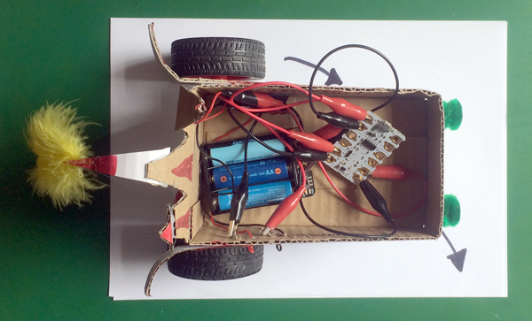

--- /task ---

--- task ---

Make sure your battery pack is turned off, then plug your Crumble back into your computer. Next, you will write the code to make the motor on the left-hand side turn.

When the `program starts`{:class="crumblebasic"}, `wait 2 seconds`{:class="crumblecontrol"} to give yourself time to move away after you turn the battery pack on. Next, tell the motor on the left-hand side (`motor 2`{:class="crumbleinputoutput"}) to go `FORWARD`{:class="crumbleinputoutput"}, then to `wait 1 second`{:class="crumblecontrol"}, then to `STOP`{:class="crumbleinputoutput"}.

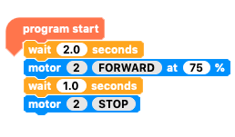

Check that the battery pack is still turned off, then run your program to transfer the changes to the Crumble controller. When the program runs, the motors will not turn, because the battery pack is turned off. This is good, because if the buggy spins around, the cable could get twisted.

Now, unplug the USB cable and put the buggy wherever you have enough space, then turn on the battery pack to run the program.

--- no-print ---

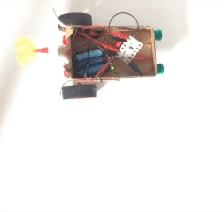

--- /no-print ---

--- print-only ---

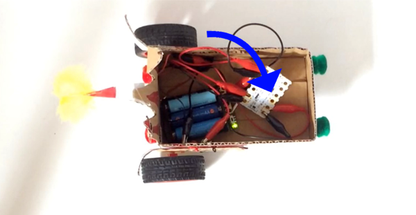

--- /print-only ---

--- /task ---

As you can see, when the motor on the left-hand side goes forwards, the buggy turns to the right.

--- task ---

Now, put your buggy on another sheet of paper. Imagine the motor on the left-hand side turning forwards and the motor on the right-hand  side turning backwards. 

Draw arrows to show where the wheels would go, and try to imagine what this would make the buggy do.

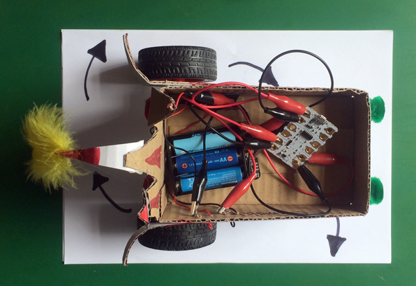

--- /task ---

--- task ---

Just like before, turn your battery pack off and connect your Crumble to the computer. Next, you will write the code to make both motors turn.

After the `motor 2 FORWARD`{:class="crumbleinputoutput"} block, add a `motor 1 REVERSE`{:class="crumbleinputoutput"} block to tell the motor on the right-hand side to go backwards.

Then, after the `wait 1 second`{:class="crumblecontrol"} block, add a block to `STOP`{:class="crumbleinputoutput"} `motor 1`. Remember to turn everything off at the end of your code — unless you want it to keep running!

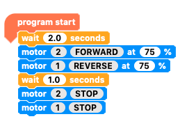

Run your program to transfer the changes to the Crumble controller. Again, the motors will not turn, because the battery pack is turned off. Remember to check that the battery pack is turned off whenever you want to transfer code without running it.

Now, unplug the USB cable and turn on the battery pack to run the program.

--- no-print ---

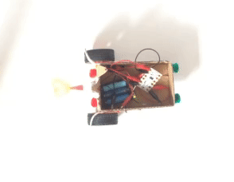

--- /no-print ---

--- print-only ---

--- /print-only ---

--- /task ---

When the motor on the right-hand side turns backwards at the same time as the motor on the left-hand side goes forwards, the turn is much sharper. The buggy will turn on the spot.

To turn left, the motors will need to turn in the opposite directions. The motor on the right-hand side will turn forwards while the motor on the left-hand side turns backwards.

--- task ---

Connect your Crumble (remember to turn the battery pack off) and change your code to `motor 1 FORWARD`{:class="crumbleinputoutput"} and `motor 2 REVERSE`{:class="crumbleinputoutput"}.

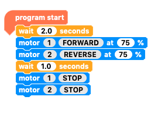

Run your program with the battery pack turned off to transfer the changes to the Crumble controller, then unplug the USB cable. Next, turn on the battery pack to run the program, to check that your buggy now turns to the left.

--- no-print ---

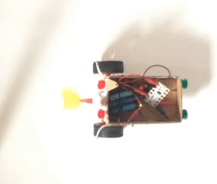

--- /no-print ---

--- print-only ---

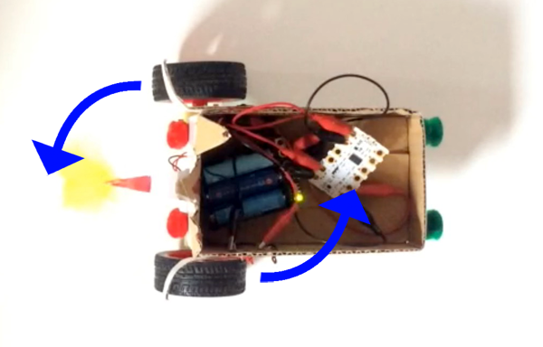

--- /print-only ---

--- /task ---

Now, you know how to make your buggy go forwards, backwards, right and left, and how to control the speed.
