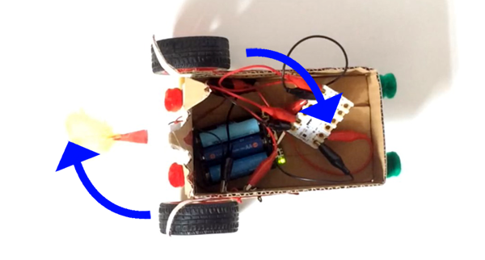

## Speed and spins

We have already looked at how to make your motor buggy go forwards and backwards. Now we are going to look at controlling the speed as well as turning left and right.

### Controlling the speed

--- task ---

Starting, of course, with a `program start`{:class="crumblebasic"} block, add two `motor`{:class="crumbleinputoutput"} blocks, one for `motor 1`{:class="crumbleinputoutput"} and the other for `motor 2`{:class="crumbleinputoutput"}.

Add a `wait`{:class="crumblecontrol"} block and change it to `wait 300 milliseconds`{:class="crumblecontrol"}.

--- /task ---

--- task ---

Duplicate these three blocks and place them beneath the existing ones. 

Change the `motor`{:class="crumbleinputoutput"} speed to `50%`{:class="crumbleinputoutput"} and the `wait`{:class="crumblecontrol"} time to `600 milliseconds`{:class="crumblecontrol"}.

--- /task ---

--- task ---

Now duplicate the last three blocks and place them at the bopttom of your code. 

Change the `motor`{:class="crumbleinputoutput"} speed to `25%`{:class="crumbleinputoutput"} and the `wait`{:class="crumblecontrol"} time to `1200 milliseconds`{:class="crumblecontrol"}.

--- /task ---

--- task ---

Lastly, add two `motor`{:class="crumbleinputoutput"} blocks telling the motors to `STOP`{:class="crumbleinputoutput"}.

Run your code and see the buggy run at three different speeds.

If the change is too quick, make longer waiting times and run it again.

--- no-print ---

--- /no-print ---

--- print-only ---

--- /print-only ---

--- /task ---

### Set your Crumble free!

My Crumble motor buggy ran off the edge of mydesk which tells me it is time to look at unplugging the Crumble and setting it free to roam on the floor.

While the Crumble is plugged in to your computer it is getting continuous power through the USB cable and so turning your battery pack on or off does not turn the Crumble on and off but when you unplug the USB cable, whatever code was last run on your Crumble will run as soon as the battery pack is turned on.

In this case, the Crumble buggy will start moving forward at slower and slower speeds until, after 2.1 seconds, it stops.

The problem with the code we have at the moment is that the motors will want to start the moment I switch the power on and won't even give me time to get my hands out of the way!

--- task ---

Add a short `delay`{:class="crumblecontrol"} to the beginning of your code to give you time to get your hands out the way when turning your battery pack on.

Run your code to transfer the changes to the Crumble controller, turn the battery pack off and unplug the USB cable.

Find yourself a bit of space and turn the battery pack on to set your buggy in motion.

--- no-print ---

--- /no-print ---

--- print-only ---

--- /print-only ---

--- /task ---

### Turning right and turning left

You have already made your buggy go forwards and backwards but let's think about what the motors will have to do to turn right or left.

If only the left-hand motor turned on and it went forwards, what would your buggy do?

--- task ---

Put your buggy on a sheet of paper. Imagine the left-hand motor turning forwards. 

Draw an arrow to show where the wheel would go and try to imagine what this means the buggy would do.

--- /task ---

--- task ---

Make sure your battery pack is turned off and plug your Crumble back into your computer and write the code to make this simple turn happen.

When the `program starts`{:class="crumblebasic"}, `wait 2 seconds`{:class="crumblecontrol"} to give yourself time to move your hand after turning the battery pack on, tell the left-hand motor(`motor 2`{:class="crumbleinputoutput"}) to go `forwards`{:class="crumbleinputoutput"}, `wait 1 second`{:class="crumblecontrol"} and turn `motor 2 off`{:class="crumbleinputoutput".

Check that the battey pack is still off and run your code to transfer the changes to the Crumble controller. Although the code has run, the motors will not turn because you turned the battery pack off. This is good because we don't want the buggy spinning round andthe cable getting twisted.

Now, unplug the USB cable and get back on the floor, or wherever you have enough space, turn on the battery pack to run the code.

--- no-print ---

--- /no-print ---

--- print-only ---

--- /print-only ---

--- /task ---

--- task ---

Now, put your buggy on another sheet of paper. Imagine the left-hand motor turning forwards and the right-hand motor turning in reverse. 

Draw arrows to show where the wheels would go and again, try to imagine what this means the buggy would do.

--- /task ---

--- task ---

Just like before, turn your battery pack off and plug your Crumble back into your computer to write the code to make this two motor turn happen.

After the `motor 2 forwards`{:class="crumbleinputoutput" block, add a `motor 1 reverse`{:class="crumbleinputoutput" block to tell the right-hand motor to go backwards.

You will also need to turn `motor 1 off`{:class="crumbleinputoutput" after the `wait 1 second`{:class="crumblecontrol"}. Always remember to turn everything off at the end of your code... unless you want it running forever!

Run your code to transfer the changes to the Crumble controller. Again, the motors will not turn because you turned the battery pack off. Remember to check the battery pack is off whenever you want to transfer code without running it.

Now, unplug the USB cable and turn on the battery pack to run the code.

--- no-print ---

--- /no-print ---

--- print-only ---

--- /print-only ---

--- /task ---