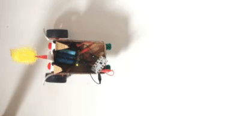
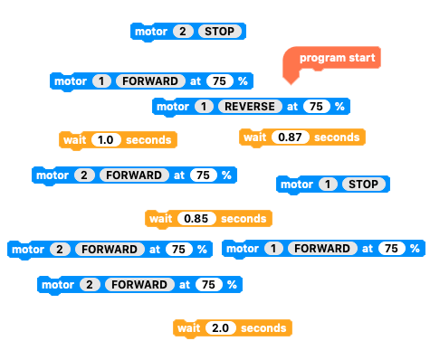
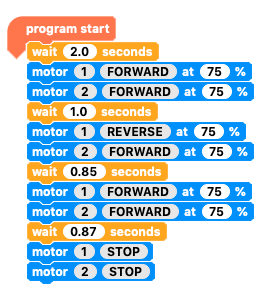

## Challenge: send your buggy 'there and back again'

Code your Crumble motor robot buggy to start off in a set place, go forwards about 30cm, then turn around and come back to the starting position.

This might sound easy, but it can be difficult to get the right timing and speed to turn around 180°. You might also find that your buggy does not drive quite as straight as you would like.

--- no-print ---

--- /no-print ---

--- print-only ---

--- /print-only ---

**Note**: The buggy might need longer to travel 30cm and to turn 180° as the charge in the batteries gets lower.

--- hints ---

--- hint ---

When the `program starts`{:class="crumblebasic"}, it should `wait`{:class="crumblecontrol"} a couple of seconds and then turn both motors `FORWARD`{:class="crumbleinputoutput"}, then `wait`{:class="crumblecontrol"} until the buggy has travelled about 30cm. Then, the motors should turn right until they have turned 180° (a half turn), then both motors should turn `FORWARD`{:class="crumbleinputoutput"} until the buggy is back in its starting position. Then, both motors should `STOP`{:class="crumbleinputoutput"}.

--- /hint ---

--- hint ---

You will need to use the blocks below to create the 'there and back again' code.

Can you rearrange them and alter the wait times to make the code work?

--- /hint ---

--- hint ---

The code below works for the example buggy. You might need to alter the wait times and speeds for your buggy.

Click the green **Play** button to see if it works.

--- /hint ---

--- /hints ---
