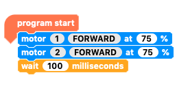
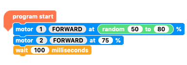
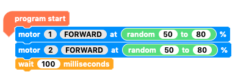
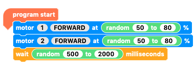
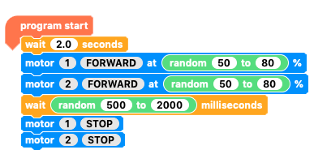
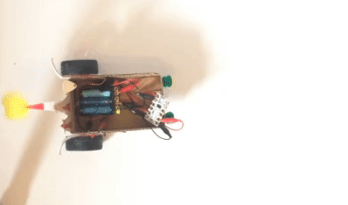
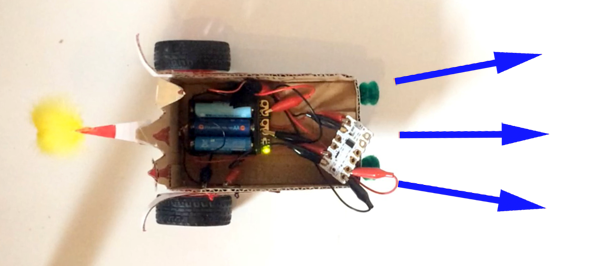

## Random journey 1

Now you are going to code a random journey for your Crumble buggy using the `motor`{:class="crumbleinputoutput"}, `wait`{:class="crumblecontrol"} and `random`{:class="crumbleoperators"} blocks.

--- task ---

We start with, you guessed it, the `program start`{:class="crumblebasic"} block and add two `motor`{:class="crumbleinputoutput"} blocks, one for `motor 1`{:class="crumbleinputoutput"} and the other for `motor 2`{:class="crumbleinputoutput"}.

Add a `wait 100 milliseconds`{:class="crumblecontrol"} block.

--- /task ---

Now it's time to put in our first random factors.

We are going to randomise the speeds at which the motors move and the time they run for.

Since it is likely that the two motors will have different speeds the buggy is likely to not drive straight forwards.

--- task ---

Pick a `random 0 to 10`{:class="crumbleoperators"} block from the `Operators`{:class="crumbleoperators"} palette.

Place it in the speed section of the first `motor`{:class="crumbleinputoutput"} block and set the number range from `50`{:class="crumbleoperators"} to `80`{:class="crumbleoperators"}.

--- /task ---

--- task ---

Duplicate the `random 50 to 80`{:class="crumbleoperators"} block and place it the speed control of the second `motor`{:class="crumbleinputoutput"} block.

--- /task ---

--- task ---

Duplicate either of the `random 50 to 80`{:class="crumbleoperators"} blocks, place it the `wait`{:class="crumblecontrol"} block and set the range from `500`{:class="crumbleoperators"} to `2000`{:class="crumbleoperators"}. That is half a second to two seconds.

--- /task ---

This is a good time to test the code so far, but before we do that we need to add code to `stop`{:class="crumbleinputoutput"} the `motors`{:class="crumbleinputoutput"} and a short `wait`{:class="crumblecontrol"} at the start of our code.

--- task ---

Add a `2 second wait`{:class="crumblecontrol"} at the start of the code.

Get two `motor`{:class="crumbleinputoutput"} blocks and set `motors 1 and 2`{:class="crumbleinputoutput"} to `stop`{:class="crumbleinputoutput"}. Add them to the end of your code so far

Go through the usual routine of checking the battery power is off, click play, unplug and then test your code.

Run it a few times to see the variation in speeds and times.

--- no-print ---

--- /no-print ---

--- print-only ---

--- /print-only ---

--- /task ---