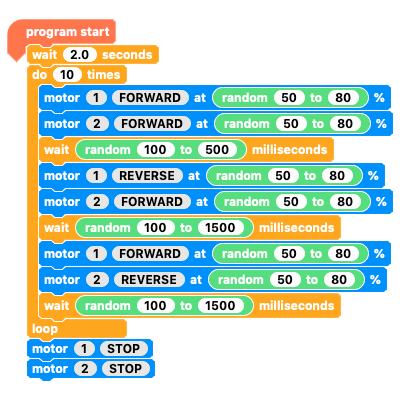

## Create a random journey

Now you are going to code a random journey for your Crumble buggy using the `motor`{:class="crumbleinputoutput"}, `wait`{:class="crumblecontrol"} and `random`{:class="crumbleoperators"} blocks.

--- task ---

As always, start with the `program start`{:class="crumblebasic"} block. Add two `motor`{:class="crumbleinputoutput"} blocks, one for `motor 1`{:class="crumbleinputoutput"} and the other for `motor 2`{:class="crumbleinputoutput"}.

Add a `wait 100 milliseconds`{:class="crumblecontrol"} block.

--- /task ---

Now, you will put in the first random factors.

You will randomise how fast the motors move and how long they run for.

Since it is likely that the two motors will run at different speeds, it is likely that the buggy will not drive forwards in a straight line.

--- task ---

Take a `random 0 to 10`{:class="crumbleoperators"} block from the **Operators** blocks menu.

Place it into the first `motor`{:class="crumbleinputoutput"} block and set the number range from `50`{:class="crumbleoperators"} to `80`{:class="crumbleoperators"}.

--- /task ---

--- task ---

Duplicate the `random 50 to 80`{:class="crumbleoperators"} block and place it into the second `motor`{:class="crumbleinputoutput"} block.

--- /task ---

--- task ---

Duplicate either of the `random 50 to 80`{:class="crumbleoperators"} blocks, place it in the `wait`{:class="crumblecontrol"} block, then set the range from `500`{:class="crumbleoperators"} to `2000`{:class="crumbleoperators"} (half a second to two seconds).

--- /task ---

Before you test the program, you need to add code to `wait`{:class="crumblecontrol"} at the start and `stop`{:class="crumbleinputoutput"} the motors at the end.

--- task ---

Add a `wait 2 seconds`{:class="crumblecontrol"} block at the start of the program.

At the bottom of the program, add two `motor`{:class="crumbleinputoutput"} blocks and set motors `1` and `2`to `STOP`{:class="crumbleinputoutput"}. 

As before, check that the battery pack is turned off, run the program, unplug the Crumble, then test your program.

Run it a few times to see the variation in speeds and times.

--- no-print ---

--- /no-print ---

--- print-only ---

--- /print-only ---

--- /task ---

Next, you will add some random turns. In this example, the buggy will turn right, then turn left. Since the turns are random, the buggy is likely to turn further one way than the other.

--- task ---

First, move the `STOP`{:class="crumbleinputoutput"} blocks away while you work on the program, because they always need to be at the end of the program.

--- /task ---

--- task ---

Duplicate the section that causes your buggy to move randomly. Keep the blocks separate from your main program for now.

--- /task ---

--- task ---

To make a right-hand turn, toggle the `motor 1`{:class="crumbleinputoutput"} block to `REVERSE`{:class="crumbleinputoutput"}.

Change the `wait`{:class="crumblecontrol"} time to between `100`{:class="crumbleoperators"} and `1500 milliseconds`{:class="crumbleoperators"}.

--- /task ---

--- task ---

To make a left-hand turn, duplicate the right-hand turn blocks that you have just made, toggle the `motor 1`{:class="crumbleinputoutput"} block to `FORWARD`{:class="crumbleinputoutput"} and the `motor 2`{:class="crumbleinputoutput"} block to `REVERSE`{:class="crumbleinputoutput"}.

Now, join up the sections that cause the buggy to move forward, turn right, and turn left. Leave the `STOP`{:class="crumbleinputoutput"} blocks  to one side.

--- /task ---

You now have a random forward move, a random right-hand turn, and a random left-hand turn. Your buggy just needs to repeat that.

--- task ---

Move the main program below the `wait 2 seconds`{:class="crumblecontrol"} block away into a separate space.

Put it into a `do 10 times`{:class="crumblecontrol"} loop.

Add the loop to the `program start`{:class="crumblebasic"} and the `wait 2 seconds`{:class="crumblecontrol"} blocks. 

Now add the `STOP`{:class="crumbleinputoutput"} blocks to the end of the program.

**Note**: If you only have a small space for your buggy to move around in, reduce the `wait`{:class="crumbleoperators"} time in the section that moves the buggy `FORWARD`{:class="crumbleoperators"}, e.g. between `100`{:class="crumbleoperators"} and `500 milliseconds`{:class="crumbleoperators"}.

--- /task ---

--- task ---

Run your program. Adjust it if you think anything needs to be changed.

--- no-print ---

--- /no-print ---

--- print-only ---

--- /print-only ---

--- /task ---
