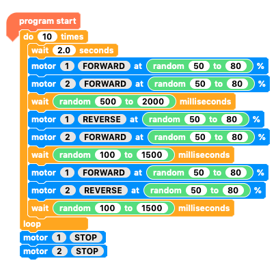
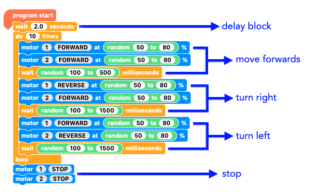
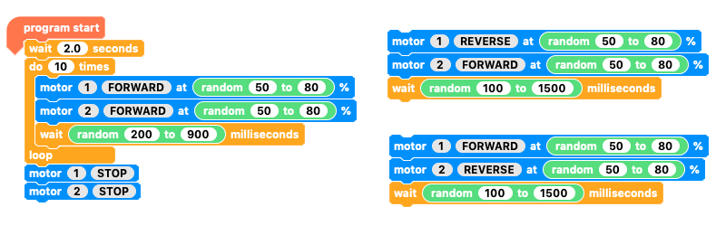
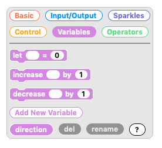
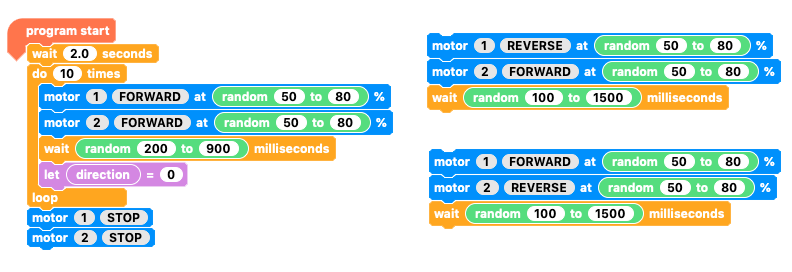
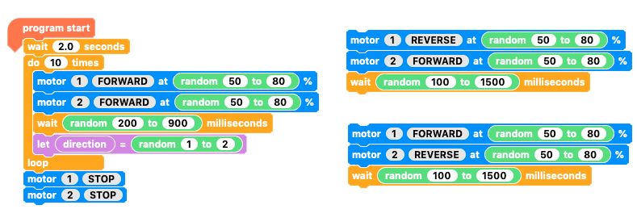
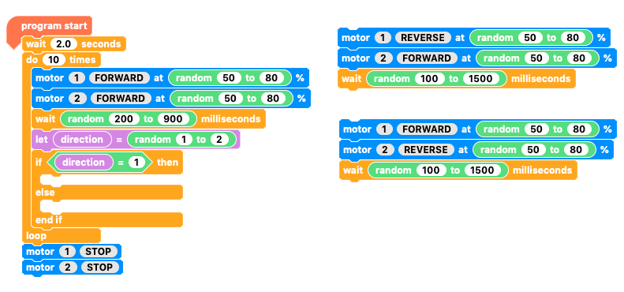
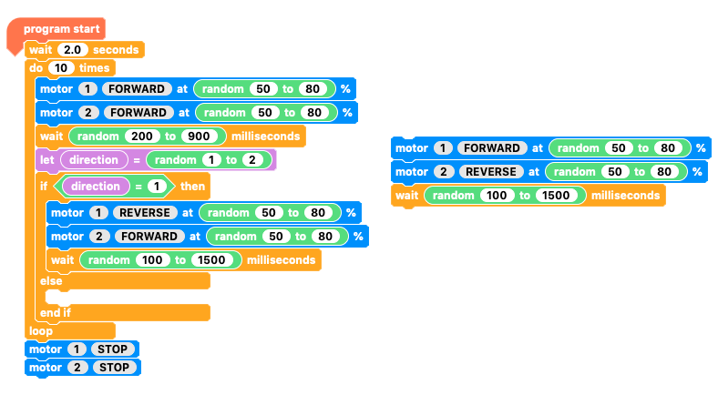
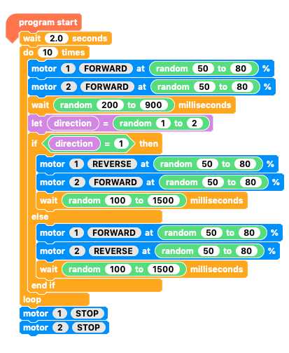
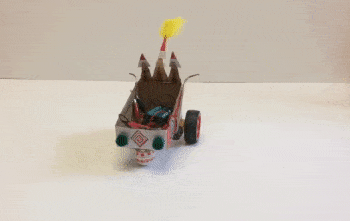

## Random journey 2

Random journey 1 was a repeat loop with three basic steps:
+ move a random distance
+ turn right a random rotation
+ turn left a random rotation

It would make more sense to simply turn either left or right by a random amount but randomising whether you turn left or right is a little more complicated, so that's what we are going to do next!

--- task ---

We'll start with the code that we ended with for 'random journey 1'.

If you don't already have it, open it now,and if you didn't save it, then make it now.

--- /task ---

Let's just recap what each part of the code does before we start taking some parts out.

--- task ---

The first thing to do is separate and pull out the sections that turn right and turn left.

--- /task ---

From now on we'll use either the right turn or the left turn but not both.

We're going to make a variable to help our program decide which direction to turn.

--- task ---

In the `Variables`{:class="crumblevariables"} palette, click `Add New Variable`{:class="crumblevariables"}.

Enter a name that makes sense for choosing direction like 'direction' or 'right or left?'.

Note: Neither the computer nor the Crumble care what the variable is called but is best to choose names that help us understand what the variable is for.

--- /task ---

--- task ---

Get a `let   = 0`{:class="crumblevariables"} from the `Variables`{:class="crumblevariables"} palette and add a rounded end `direction`{:class="crumblevariables"} block into the empty space

--- /task ---

--- task ---

Get a `random number`{:class="crumbleoperators"} block, put it in the `let direction = 0`{:class="crumblevariables"} value box andset the range from `1`{:class="crumbleoperators"} to `2`{:class="crumbleoperators"}.

--- /task ---

This means that, for each `repeat`{:class="crumblecontrol"} cycle, the `direction`{:class="crumblevariables"} variable will be set to either `1`{:class="crumbleoperators"} or `2`{:class="crumbleoperators"}.

We are going to use this by saying, `if`{:class="crumblecontrol"} `direction =`{:class="crumblevariables"} `1`{:class="crumbleoperators"} `then`{:class="crumblecontrol"} `turn right`{:class="crumbleinputoutput"} but `if`{:class="crumblecontrol"} `direction =`{:class="crumblevariables"} `2`{:class="crumbleoperators"} `then`{:class="crumblecontrol"} `turn left`{:class="crumbleinputoutput"}.

Since `direction`{:class="crumblevariables"} can only be `1`{:class="crumbleoperators"} or `2`{:class="crumbleoperators"}, we'll actually say `if`{:class="crumblecontrol"} `direction =`{:class="crumblevariables"} `1`{:class="crumbleoperators"} `then`{:class="crumblecontrol"} `turn right`{:class="crumbleinputoutput"} `else`{:class="crumblecontrol"} `turn left`{:class="crumbleinputoutput"}.

So let's ask if `if`{:class="crumblecontrol"} `direction =`{:class="crumblevariables"} `1`{:class="crumbleoperators"}.

--- task ---

Get an `if... then... else...`{:class="crumblecontrol"} block from the `Control`{:class="crumblecontrol"} palette and add it under the `variable`{:class="crumblevariables"} setting block.

In the hexagonal space you need to add a `0 = 0`{:class="crumbleoperators"} block.

Place a rounded end `direction`{:class="crumblevariables"} variable block in the place of the first `0`{:class="crumbleoperators"} and change the second `0`{:class="crumbleoperators"} to `1`{:class="crumbleoperators"}.

--- /task ---

The `if... then... else...`{:class="crumblecontrol"} block has two open sections waiting for code. 
+ The first is for what happens if the condition is true, i.e. `if`{:class="crumblecontrol"} `direction`{:class="crumblevariables"} does `equal`{:class="crumblevariables"} `1`{:class="crumbleoperators"}
+ The second, the `else`{:class="crumblecontrol"} part, is for what happens `if`{:class="crumblecontrol"} `direction`{:class="crumblevariables"} does NOT `equal`{:class="crumblevariables"} `1`{:class="crumbleoperators"}.

--- task ---

Inside the `if`{:class="crumblecontrol"} `direction`{:class="crumblevariables"} does `equal`{:class="crumblevariables"} `1`{:class="crumbleoperators"} `then`{:class="crumblecontrol"} open section, add the code that you already have to make your buggy turn right.

--- /task ---

--- task ---

And inside the `else`{:class="crumblecontrol"} open section, add your code to make your buggy turn left.

--- /task ---

--- task ---

The only left to do is excecute your code.

--- no-print ---

--- /no-print ---

--- /task ---